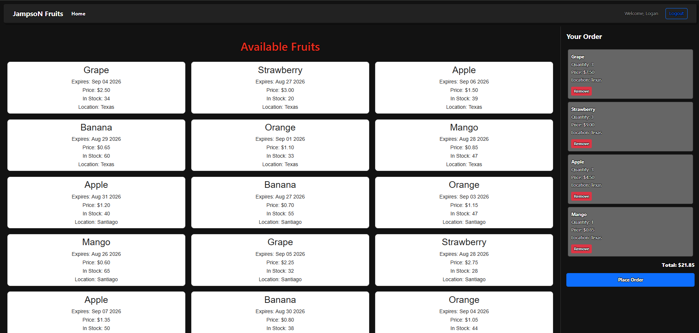
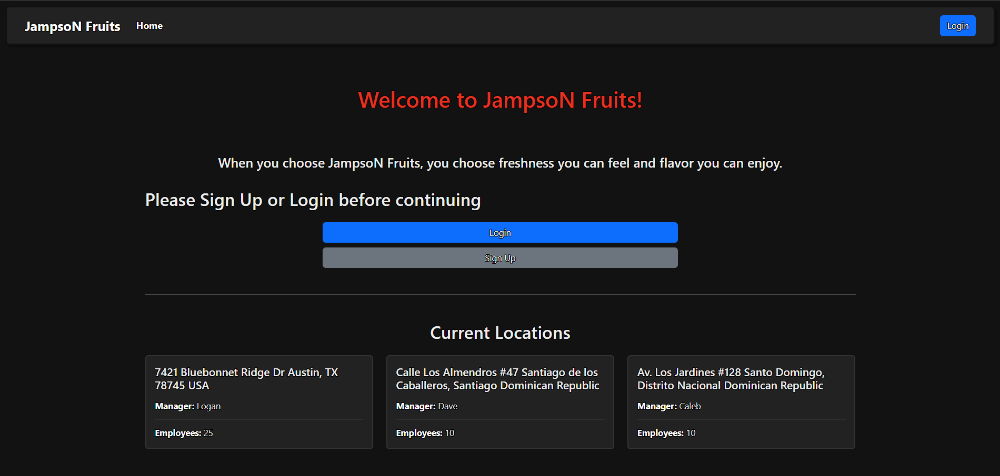
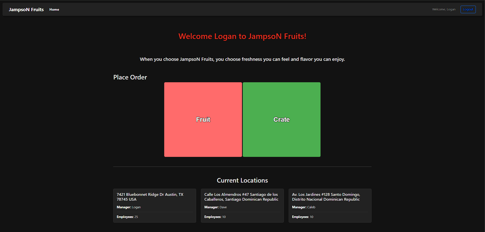
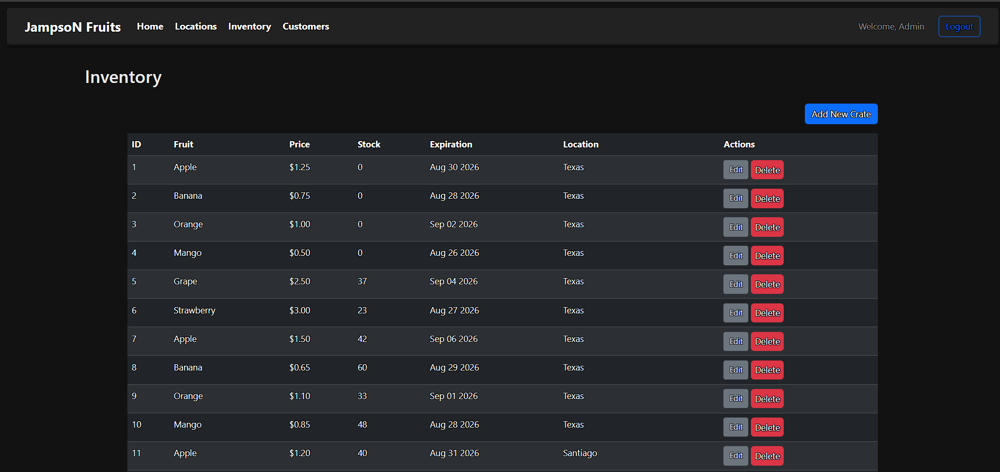

# JampsoN

A web-based inventory and ordering application built with Flask.

## Features

- Customer management
- Inventory management
- Location management
- Order management
- Fruit ordering
- Crate ordering
- User authentication

## Technologies

- Python
- Flask
- SQLite
- HTMX
- HTML
- CSS
- Bootstrap

## Screenshots

### Fruit Ordering

Customers can select individual fruit items, manage their cart, view the order total, and place an order.



### Public Homepage

The public-facing homepage presented to users who are not logged in.



### Authenticated User View

The interface available to users after signing in.



### Admin Inventory Management

Administrators can manage available inventory through a dedicated management interface.



## Getting Started

### 1. Clone the repository

```bash
git clone https://github.com/loganmicahclay-hash/JampsoN.git
cd JampsoN
```

### 2. Create a virtual environment

**Windows PowerShell:**

```powershell
python -m venv .venv
.venv\Scripts\Activate
```

**macOS/Linux:**

```bash
python3 -m venv .venv
source .venv/bin/activate
```

### 3. Install dependencies

```bash
pip install -r requirements.txt
```

### 4. Set up the database

```bash
python initdb.py
python seed.py
```

### 5. Run the application

```bash
export FLASK_APP=app.py
export FLASK_DEBUG=1
flask run
```

Open the local address displayed by Flask in your web browser.

## Author

Logan Clay